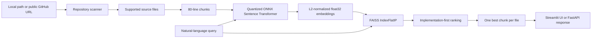

# CodeLens

> Semantic code search for unfamiliar repositories.

CodeLens helps developers find relevant implementation without knowing where it lives. Provide a local repository path or public GitHub URL, scan supported source files, generate semantic embeddings, index the code with FAISS, and ask natural-language questions through a Streamlit workspace or REST API.

## Live Demo

| Surface | URL |
|---|---|
| Frontend | [codelens-i03c.onrender.com](https://codelens-i03c.onrender.com) |
| API | [codelens-api-5r3t.onrender.com](https://codelens-api-5r3t.onrender.com) |
| Swagger Docs | [API documentation](https://codelens-api-5r3t.onrender.com/docs) |

## Features

- Natural-language semantic search over unfamiliar codebases.
- Local repository indexing and public GitHub repository cloning.
- Line-based chunking with file and line-range metadata.
- Quantized ONNX Sentence Transformer embeddings using `batch_size=4`.
- L2-normalized embeddings searched with FAISS `IndexFlatIP`.
- Implementation-first ranking that deprioritizes test files.
- Result diversification with at most one best-scoring chunk per file.
- Streamlit frontend with searchable code excerpts and native code-copy controls.
- FastAPI backend with interactive Swagger documentation.

## Architecture



## Tech Stack

- **Python** for the application and search pipeline.
- **Sentence Transformers** with **ONNX** runtime/model support for embeddings.
- **FAISS** for vector similarity search.
- **FastAPI** for the REST API.
- **Streamlit** for the interactive frontend.
- **GitPython** for cloning public GitHub repositories.
- **NumPy** for embedding normalization and array handling.
- **Render** for the deployed frontend and API services.

## How It Works

1. **Index**: the parser recursively scans supported source files, skips common build and virtual-environment directories, and ignores files larger than 500 KB.
2. **Chunk**: each non-empty file is split into line-based chunks of up to 80 lines, retaining 1-based start and end lines.
3. **Embed**: the quantized ONNX `all-MiniLM-L6-v2` Sentence Transformer encodes chunks in batches of four. Embeddings remain `float32` and are L2-normalized.
4. **Search**: FAISS `IndexFlatIP` compares the normalized query embedding with indexed chunks.
5. **Rank**: implementation files are preferred over test files, then duplicate files are removed while retaining each file's highest-ranked chunk.

## API Endpoints

| Method | Endpoint | Description |
|---|---|---|
| `GET` | `/health` | Returns the service health status. |
| `POST` | `/index` | Indexes a local repository path or public GitHub URL. |
| `GET` | `/search` | Searches the active in-memory index with `q` and optional `top_k`. |

Swagger documentation is available at `/docs` on the deployed API.

## Example API Request

Index a repository:

```bash
curl -X POST "https://codelens-api-5r3t.onrender.com/index" \
  -H "Content-Type: application/json" \
  -d '{"repo_path":"https://github.com/example/project"}'
```

Search the indexed repository:

```bash
curl "https://codelens-api-5r3t.onrender.com/search?q=Where%20is%20authentication%20handled%3F&top_k=5"
```

A search result contains `file`, `start_line`, `end_line`, `score`, and `content`.

## Supported Source Languages

The repository scanner currently includes files with these extensions:

`.py` · `.js` · `.ts` · `.java` · `.cpp` · `.c` · `.go`

## Semantic Search vs. Ctrl+F

Ctrl+F and keyword search require the query to share exact words with the target code. CodeLens compares semantic embeddings, so a natural-language question can surface related implementation even when the code uses different identifiers or phrasing. Results still point back to the original file, line range, and code content for verification.

## Deployment

CodeLens is deployed as separate frontend and API services on Render:

- The **FastAPI** service exposes indexing, search, health, and Swagger endpoints.
- The **Streamlit** service provides the interactive UI and sends requests to the API through `CODELENS_API_URL`.
- Indexes and embeddings are held in memory by the running API process; they are not persisted to a database or disk.

For local development:

```powershell
python -m venv .venv
.\.venv\Scripts\Activate.ps1
pip install -r requirements.txt
```

Start the API:

```powershell
uvicorn api:app --reload --host 127.0.0.1 --port 8000
```

Start the frontend in a second terminal:

```powershell
$env:CODELENS_API_URL = "http://127.0.0.1:8000"
streamlit run app.py
```

## Project Structure

```text
CodeLens/
├── api.py                    # FastAPI application and REST endpoints
├── app.py                    # Streamlit frontend
├── core/
│   ├── embeddings.py         # Quantized ONNX embedding wrapper
│   ├── parser.py             # Repository scanning and chunking
│   └── search.py             # FAISS indexing and diversified ranking
├── test_embeddings.py        # Embedding shape and normalization check
├── test_parser.py            # Scanner and chunking script
├── test_search.py            # Search pipeline and regression check
├── requirements.txt          # Runtime dependencies
├── requirements-frontend.txt # Frontend dependencies
└── requirements-render.txt   # Render deployment dependencies
```

## Testing

The repository includes executable validation scripts:

```powershell
python test_embeddings.py
python test_parser.py
python test_search.py
```

The search regression also verifies that duplicate files are not returned and that the best chunk is retained. For syntax validation:

```powershell
python -m py_compile api.py app.py core\embeddings.py core\parser.py core\search.py
```

## Future Improvements

- Persistent index storage.
- Incremental repository re-indexing.
- Asynchronous indexing for larger repositories.
- Language-aware or AST-based chunking.
- Automated CI coverage and deployment recipes.

## Author

**Rishi-D7**

Built as a focused semantic code intelligence tool for developers working in unfamiliar repositories.
